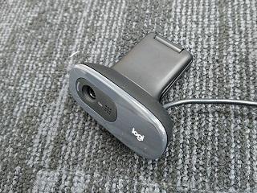
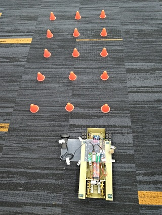
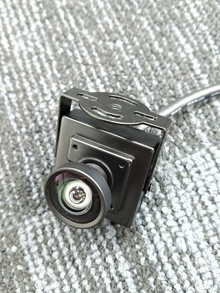
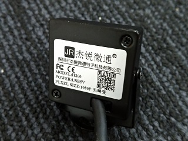
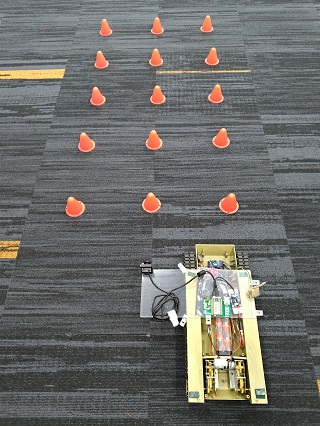
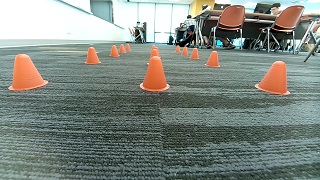

# webcam_rasp_for_auto_drive_mjpg-streamer
Making a webcam for toy card auto drive by rasp3B with low latency and low loading  
用樹莓3B建立webam, 用於玩具車的自動駕駛. 具有低延時,低CPU負載.  

也可以使用Linkit 7688/mt7688取代Rasp, 達到更省電,更輕量化的效果.  
Linkit 7688/mt7688的USB安裝檔案在此:  
greatcattw/linkit7688_3.18.23_img_duo_MCU  
USB安裝檔案已內建mjpg-streamer

樹莓硬體為  
rasp3B  

樹莓作業系統為  
2022-04-04-raspios-buster-armhf.img  
9d2d2db345e9e7d511bad6493031b8f3  

USB攝影機為  
Logi C270  

影像預設的尺寸為1280x720  

這個版本使用JPEG格式,找到這個版本是個意外.  
相較YUV & MJPG,對樹莓CPU的負載較低.  
原因待查.  

## 安裝
一鍵安裝的版本  
下載後放到U盤,插上樹莓,執行
set_as_ap.sh  
安裝後重啟樹莓  

## 測試  
使用其它電腦/手機的WiFi掃瞄,可以看到webcam這個AP  
無帳密登入,取得IP為192.168.100.x  
使用瀏覽器  
192.168.100.1:8080/?action=snapshot  
可以看到攝影機的影像  

## 選用USB攝影機
初次測試時,使用常見的logi c270, 這個USB攝影機的視角為55度,視角有點窄,不太適用於自動駕駛.  
 
 
 
找了一隻135度無畸變的攝影機. m
 
 
 
 
 

